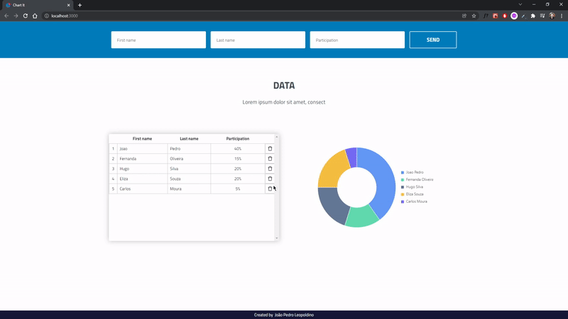

<h1 align="center">Desafio T10</h1>

<p align="center">Full-stack Engineer</p>

<p align="center">
 <a href="#speech_balloon-sobre">Sobre</a> •
 <a href="#rocket-como-rodar">Como Rodar</a> • 
 <a href="#wrench-tecnologias">Tecnologias</a> • 
 <a href="#coffee-autor">Autor</a>
</p>

<div align="center">
    
</div>

## :speech_balloon: **Sobre**
O objectivo desse desafio é avaliar seu domínio no desenvolvimento fullstack: organização, estilo e boas práticas, criação de APIs, conhecimento de frameworks e tecnologias.

---
## :rocket: **Como Rodar**
###### Back-End:
```bash
# Acesse o diretório do projeto
$ cd backend

# Instale todas as dependencias
$ yarn install

# Inicie a api
$ yarn dev

```
__
###### Front-End:
```bash
# Acesse o diretório do projeto
$ cd frontend

# Instale todas as dependencias
$ yarn install

# Inicie o frontend
$ yarn start

```
Esse projeto roda no seu localhost.
Abra [http://localhost:3000](http://localhost:3000) para vê-lo no seu browser.

---
## :wrench: **Tecnologias**

As seguintes tecnologias foram usadas para contruir esse projeto:

###### Back-End:
- [NodeJS](https://nodejs.org/en/)
    - [Express](https://expressjs.com/pt-br/)
- [Firebase - Cloud Firestore](https://firebase.google.com/docs/firestore)
- [TypeScript](https://www.typescriptlang.org/)

> Veja mais em [package.json](https://github.com/JPLeopoldino/desafio-t10/blob/main/backend/package.json)

__
###### Front-End:
- [React](https://pt-br.reactjs.org/)
- [Ant Design](https://ant.design/docs/react/introduce)
    - [Ant Design Charts](https://charts.ant.design/en/docs/manual/getting-started)
- [Styled Components](https://styled-components.com/)
- [Axios](https://axios-http.com/docs/intro)
- [Formik](https://formik.org/docs/overview)
- [TypeScript](https://www.typescriptlang.org/)

> Veja mais em [package.json](https://github.com/JPLeopoldino/desafio-t10/blob/main/frontend/package.json)

---
## :coffee: **Autor**

<a href="https://github.com/JPLeopoldino">
 
 <br />
 <sub><b>João Pedro Leopoldino</b></sub></a> <a href="https://github.com/JPLeopoldino" title="GitHub">🌌</a>


Criado por João Pedro Leopoldino 👋🏻 [Fale comigo!](https://www.linkedin.com/in/jpleopoldino/?locale=en_US)

[](https://www.linkedin.com/in/jpleopoldino/) [](mailto:leopoldino26@gmail.com)